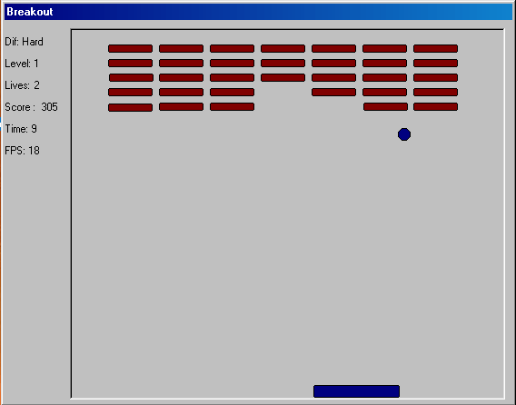



## Breakout \(with level editor\)

### Description

This is a simple clone of the game Arcanoid (Breakout). It got five different levels and three difficult levels.

It also got a high score list and various options (diff levels, and colours on the objects) that are saved from run time to run time and a very simple level editor.

Feel free to use the code however you like. And please give me feedback on what you think of it.
 
### More Info
 

             |
---                |---
**Submitted On**   |2001-12-06 23:08:20
**By**             |[Leon Ljunggren](https://github.com/Planet-Source-Code/PSCIndex/blob/master/ByAuthor/leon-ljunggren.md)
**Level**          |Beginner
**User Rating**    |4.3 (13 globes from 3 users)
**Compatibility**  |VB 6\.0
**Category**       |[Games](https://github.com/Planet-Source-Code/PSCIndex/blob/master/ByCategory/games__1-38.md)
**World**          |[Visual Basic](https://github.com/Planet-Source-Code/PSCIndex/blob/master/ByWorld/visual-basic.md)
**Archive File**   |[Breakout\_\(399011262001\.zip](https://github.com/Planet-Source-Code/leon-ljunggren-breakout-with-level-editor__1-29534/archive/master.zip)

